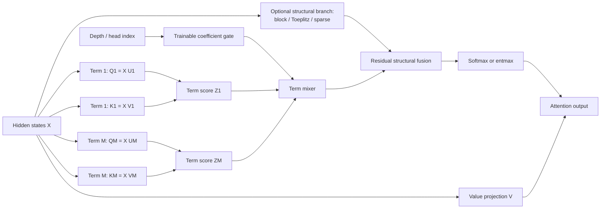
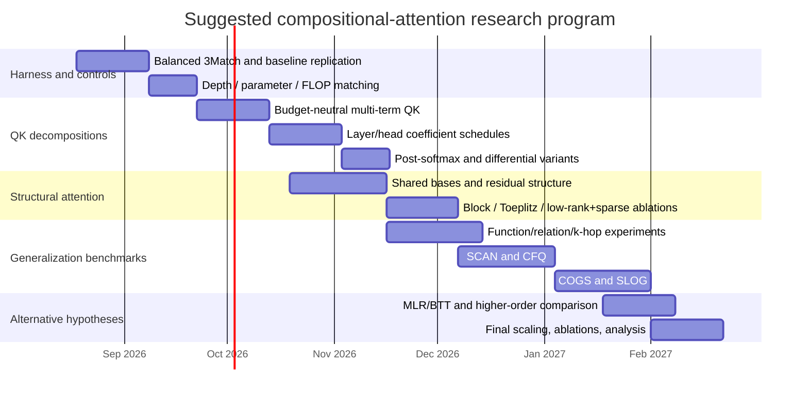

# Trainable Key/Query Decompositions and Structured Attention for Compositional Generalization

## Executive summary

The central design variable in standard self-attention is not merely “queries versus keys,” but the **trainable bilinear interaction operator** they induce. For head \(h\),

\[
Q_h=XW_{Q,h},\qquad K_h=XW_{K,h},
\]

so its pre-softmax score matrix can be written

\[
Z_h=\frac{Q_hK_h^\top}{\sqrt r}
    =\frac{X\,B_h\,X^\top}{\sqrt r},
\qquad
B_h=W_{Q,h}W_{K,h}^{\top},
\]

where \(B_h\in\mathbb R^{d\times d}\) has rank at most the query/key head dimension \(r\). Thus ordinary attention already imposes a specific trainable low-rank factorization on the token-interaction operator. The original Transformer introduced this projection-and-dot-product construction; subsequent theory has explicitly identified low per-head rank as an expressivity bottleneck, and more recent work shows that replacing the low-dimensional scorer by efficiently structured higher-rank matrices can improve fixed-compute performance. citeturn21search1turn21search0turn15search0

This observation leads to the most important conclusion of the review:

> **Simply writing the same rank-\(r\) scorer as \(M\) smaller low-rank terms is not, by itself, a new model class.**  
> If
> \[
> B_h=\sum_{m=1}^{M}U_{hm}V_{hm}^{\top},\qquad \sum_m k_m=r,
> \]
> and all terms are linearly summed before one softmax with no additional tying or constraints, this can be only a reparameterization of ordinary rank-\(r\) attention. A compositional advantage must come from the *inductive bias*: layer-dependent coefficients, sharing of basis terms across heads/layers, term-specific constraints, nonlinear/post-softmax mixtures, structured residual branches, or explicit higher-order interactions.

This distinction is especially important because the evidence points in two directions at once. Low-rank compression methods such as Linformer, Performer-style feature decompositions, MFA, Tensor Product Attention, Thin Keys, and 2026 LRKV show that substantial redundancy can be exploited for efficiency. citeturn1academia50turn17view5turn15academia5turn15academia6turn19academia0turn20academia24 But expressivity results warn that **too little Q/K rank can be harmful**, particularly on retrieval-like or relational tasks; efficiently structured high-rank BTT/MLR scorers are therefore a particularly relevant counterpoint to “compress everything.” citeturn21search0turn15search0

For compositional generalization specifically, three lines of evidence are unusually relevant. First, standard pairwise attention has provable difficulties on triple-detection problems, while higher-order Kronecker and Strassen-style attention explicitly model triple correlations. citeturn24academia1turn24academia3turn17view4 Second, the hypernetwork interpretation of multi-head attention finds that a low-dimensional latent attention code is reused for unseen task compositions, suggesting that **explicit trainable mixtures of reusable interaction terms** are mechanistically plausible. citeturn18academia24 Third, SQ-Transformer obtains stronger compositional generalization by encouraging structurally equivalent inputs to induce invariant or similar attention behavior, showing that attention structure itself can be a useful inductive bias rather than merely an interpretability artifact. citeturn18search0

Your uploaded seminar already converges on these two central hidden assumptions—the pairwise nature of attention and the particular Q/K decomposition—and also contains an important methodological warning: in its preliminary 3Match experiments, deeper ordinary attention surpasses the one-layer Strassen model. That means every proposed factorization or higher-order mechanism should be compared not just at equal depth, but under **parameter-, FLOP-, and depth-aware controls**. fileciteturn0file0 This agrees with theoretical work showing that depth can dramatically change what Transformers compute; logarithmic depth is sufficient for important multi-hop computations. citeturn24academia2

My prioritized research program is therefore:

1. **Budget-neutral multi-term Q/K attention with learned layer/head coefficients**, keeping total Q/K rank fixed while creating explicitly reusable terms.
2. **Post-softmax mixture/differential terms**, because this is genuinely more expressive than merely repartitioning a bilinear matrix; Differential Transformer provides a strong architectural precedent for two attention maps and a layer-dependent learned coefficient. citeturn17view0
3. **Residual structured attention**, \(Z=Z_{\text{content}}+\beta Z_{\text{structure}}\), using Toeplitz/local/block structure and zero-initialized trainable gates. This is exceptionally easy to ablate and connects naturally to systematic-attention results. citeturn18search0turn25academia14
4. **Shared factorized Q/K bases with head/layer-specific coefficients or low-rank residuals**, encouraging reuse of elementary “operations” rather than independently relearning every head.
5. After those experiments, test **structured high-rank MLR/BTT scoring** as the strongest alternative hypothesis: perhaps compositional generalization needs *less* low-rank restriction rather than a cleverer low-rank factorization. citeturn15search0

The evidence is strongest for studying **structure and specialization while preserving rank**, not for aggressive Q/K compression. Most 2025–2026 factorization work targets language-model quality, KV-cache efficiency, or long context—not compositional OOD generalization—so compositional benefits of MFA, TPA, Thin Keys, LRKV, and related methods should be treated as hypotheses rather than established results. citeturn15academia5turn15academia6turn19academia0turn20academia24


## Design lens and current evidence

Let \(d\) denote model width, \(H\) the number of heads, \(r=d_q=d_k\) the Q/K dimension per head, \(s=d_v\) the value dimension, \(L\) the number of layers, \(M\) the number of decomposition terms, and \(k\) a term rank. Bias parameters are omitted below.

For standard MHA,

\[
W_Q,W_K\in\mathbb R^{d\times Hr},
\]

so Q/K projections contain

\[
P_{QK}^{\text{MHA}}=2dHr
\]

parameters per layer. Under the usual \(Hr=d\),

\[
P_{QK}^{\text{MHA}}=2d^2.
\]

With \(s=r\), the four main attention projections \(Q,K,V,O\) contain approximately \(4d^2\) parameters. The score multiplication costs approximately \(O(Hn^2r)\) arithmetic for sequence length \(n\), apart from projection and softmax costs. This is the canonical Transformer construction. citeturn21search1

The effective feature-space interaction matrix

\[
B_h=W_{Q,h}W_{K,h}^{\top}
\]

is especially useful as the object of study. It separates three questions that are often conflated:

**Capacity:** What rank and matrix family can \(B_h\) represent?

**Inductive bias:** Are some directions, blocks, terms, offsets, or operations easier to learn than others?

**Token-space structure:** After applying \(B_h\) to \(X\), what constraints are imposed on the resulting \(n\times n\) score or attention matrix?

The first issue is not cosmetic. Bhojanapalli et al. showed that standard scaling of head count against head dimension creates a low-rank bottleneck. More recently, Kuang et al. replaced conventional low-dimensional scoring with computationally efficient Block Tensor-Train and Multi-Level Low Rank structured matrices; their results show that high-rank structured scorers can outperform ordinary attention at fixed compute in high-dimensional in-context regression, while MLR also gives a way to encode locality in language modeling. citeturn21search0turn15search0

The compositional-generalization evidence makes the issue sharper. Sanford, Hsu, and Telgarsky exhibit a triple-detection problem that is difficult for ordinary attention despite attention's efficiency on sparse averaging. Alman and Song construct a higher-order Kronecker generalization capable of capturing triple correlations, with a near-linear approximation in an appropriate bounded-input regime but a near-cubic barrier outside it. Strassen Attention gives another structured third-order mechanism and reports advantages on Match3, function composition, and relation-composition tasks. citeturn24academia1turn24academia3turn17view4

At the same time, depth cannot be ignored. Transformer depth is connected to rounds of parallel computation, and logarithmic depth is sufficient for important chained computations. citeturn24academia2 This makes the result in your preliminary experiment consequential: a one-layer higher-order mechanism is not a sufficient baseline comparison against ordinary multi-layer Transformers. fileciteturn0file0

A second strand of evidence supports **reusable term decompositions**. Schug et al.'s hypernetwork reinterpretation shows that attention coefficients can be regarded as a low-dimensional latent code selecting an input-dependent value operation; their experiments find that this code predicts subtasks on unseen compositions, and making the generated value network nonlinear improves compositional generalization on abstract reasoning tasks. citeturn18academia24 This is unusually close to the proposed research hypothesis: a decomposition into trainable terms can be useful when terms acquire stable functional roles and the network learns how to recombine them.

A third strand supports explicit structural constraints. SQ-Transformer encourages structurally equivalent sentences to use systematic attention through structurally quantized embeddings and systematic attention/regularization layers, obtaining stronger compositional generalization than vanilla Transformer in the tested low-complexity semantic-parsing and translation settings. citeturn18search0 Structured Attention Networks provide an older, more general precedent for putting differentiable graphical-model structure—such as chains or parse-like structures—inside an attention layer. citeturn25academia12

Finally, recent efficiency-driven decompositions provide useful design primitives but should not be mistaken for direct compositional evidence. MFA factorizes the QK circuit to scale head number/dimension efficiently; Tensor Product Attention factorizes contextual Q/K/V representations; Thin Keys argues that attention selection can use a smaller key space than value transfer; and LRKV combines shared full-rank KV projections with low-rank head-specific residuals. citeturn15academia5turn15academia6turn19academia0turn20academia24 Collectively, these works suggest that **sharing plus specialized residual capacity** is practical at modern scale—a pattern worth transplanting from KV efficiency into Q/K compositionality research.



There are two especially important variants of the mixer in this diagram. In the **pre-softmax** version, term logits are summed before normalization; with no additional restrictions this can remain an ordinary bilinear model. In the **post-softmax** version, each term is normalized separately and the resulting attention maps are mixed; this is no longer algebraically equivalent to one ordinary attention map. Differential Transformer is an important two-term example of the latter idea. citeturn17view0


## Taxonomy of trainable decomposition families

The table below treats “parameter cost” as **Q/K-related parameters per layer**, unless otherwise specified. These formulas are analytic counts for the parameterizations shown, not numbers reported by the cited papers.

| Family | Trainable parameterization | Parameter count | Main compositional hypothesis | Advantages | Risks / implementation notes |
|---|---|---:|---|---|---|
| **Additive low-rank terms** | \(B_h=\sum_m \alpha_{\ell hm}U_{hm}V_{hm}^{\top}\), \(U,V\in\mathbb R^{d\times k_m}\) | \(2Hd\sum_m k_m+C_\alpha\) | Different low-rank terms become reusable primitive relations/operations | Extremely simple; rank and budget precisely controllable; can initialize as exact decomposition of an existing Q/K scorer | With fixed coefficients and \(\sum k_m=r\), this may be only a reparameterization; term collapse is likely without sharing/diversity constraints |
| **Multiplicative low-rank metric** | \(Z=Q_0GK_0^\top,\ G=D+UV^\top\), \(U,V\in\mathbb R^{r\times k}\) | \(H(r+2rk)\) on top of base | Learn a cheap task-specific metric/geometry without replacing pretrained Q/K | Near-identity initialization; cheap retrofit; preserves pretrained representations | Cannot raise rank beyond \(r\); poorly initialized \(G\) can alter logit scale |
| **Block-sparse decomposition** | \(W_Q,W_K\) block diagonal, or \(B=\sum_g M_g\odot B_g\) | Roughly \(2dHr/G\) for \(G\) equal projection blocks | Force feature groups to learn separable roles that can recombine | Strong modular bias; hardware-friendly if block sizes align with kernels | Fixed blocks can assign the wrong coordinates; use learned permutation/rotation or residual dense path |
| **Mixture of attention terms** | \(A=\sum_m\alpha_m\,\mathrm{softmax}(Q_mK_m^\top/\sqrt{k})\) | \(2HMdk+C_\alpha\) | Each normalized map learns a distinct relation; mixture composes them | Genuinely different from one-softmax attention; interpretable; natural gating | Multiple softmaxes and attention maps increase activation/kernel overhead; gates can collapse |
| **Hierarchical decomposition** | \(B=B_0+\sum_s g_s(\ell)U_sV_s^\top\), or nested block/scale factors | \(2d\sum_s k_s+C_g\) per head if independent | Early/coarse operations reused while later/fine operations specialize | Natural for depth-dependent compositional reasoning; easy progressive activation | Hierarchy is an inductive assumption; too rigid a prescribed order can hurt |
| **Factorized shared basis** | \(B_{\ell h}=\sum_{j=1}^{R}c_{\ell hj}u_jv_j^\top\) | \(2dR+LHR\) if basis is shared across layers | Heads/layers recombine a common dictionary of elementary interactions | Very parameter-efficient; directly tests “reusable operation basis” hypothesis; highly interpretable | Shared basis may underfit if \(R\) is small; coefficient identifiability/scaling degeneracy requires normalization |
| **Learned rotations** | \(B=U R V^\top\), \(R=\exp(S), S=-S^\top\), or Householder products | \(r(r-1)/2\) per learned \(r\)-D rotation; two independent rotations double it | Discover coordinates in which block/rank structure corresponds to compositional roles | Preserves norms; useful before block or sparse factors; controlled geometry | Applying the **same** orthogonal rotation to Q and K cancels in \(QK^\top\); use a relative rotation or combine rotation with non-rotation-invariant structure |
| **Kernel / feature-map decomposition** | \(A=D^{-1}\phi_\theta(Q)(\phi_\theta(K)^\top V)\) | Typically \(O(sr)\) for learned \(r\to s\) map, more for MLP maps | Feature channels could become reusable relation detectors while eliminating explicit \(n^2\) attention | Potential linear sequence complexity; Performer provides a mature reference design | Kernelization changes the attention operator; sharp routing and relational tasks can be approximation-sensitive; direct comp-gen evidence is weak. citeturn17view5 |
| **Tensorized decomposition** | CP: \(W[i_1,\ldots,i_p]=\sum_{a=1}^{R}\prod_jG_j[i_j,a]\); TT analogous | CP \(R\sum_j n_j\); TT \(\sum_jn_jR_{j-1}R_j\), per matrix | Tensor factors encode multi-axis roles and enable parameter sharing across representation factors | Compression can be very large; TPA shows contextual tensor factorization is viable; BTT can retain high rank. citeturn15academia6turn15search0 | Tensor shape and ranks become sensitive hyperparameters; custom einsums/kernels may dominate engineering |
| **Layerwise coefficient gating** | \(\alpha_{\ell hm}=\mathrm{softmax}(c_{\ell hm})\), or \(c_{\ell hm}=f_\theta(t_\ell,h,m)\) | Global \(M\); layer \(LM\); head \(HM\); full \(LHM\); low-rank tensor \(R(L+H+M)\) | Composition changes with depth while keeping primitives reusable | Negligible parameters; excellent diagnostic of specialization | Free \(LHM\) coefficients can overfit; token-conditioned routing introduces an additional shortcut path |
| **Residual decomposition** | \(B=B_{\rm base}+\beta UV^\top\), or \(Z_\ell=Z_{\ell,\rm raw}+\gamma_\ell Z_{\ell-1}\) | Low-rank Q/K residual: \(2Hk(d+r)\); full combined-W LoRA Q+K: \(4dk\) | Let ordinary attention solve easy patterns while a small branch learns missing compositional relations | Safest retrofit; zero initialization exactly recovers baseline; ideal for controlled ablation | Residual can remain unused; monitor \(\beta\), residual norm, and rank. RealFormer establishes the practicality of residual attention across layers. citeturn25academia14 |

Two recent families deserve additional context.

**Asymmetric Q/K rank.** Thin Keys, Full Values explicitly challenges the convention that queries, keys, and values need identical dimensions and reports substantial key compression with lightweight Q/K fine-tuning. This suggests an additional compositional experiment: rather than assigning every term the same \(k\), let routing terms have narrow keys while relation-disambiguation terms receive wider query/key capacity. The paper is primarily an efficiency study, however, not evidence that asymmetry improves compositional generalization. citeturn19academia0

**Shared base plus low-rank specialization.** LRKV's 2026 parameterization uses a shared full-rank component plus low-rank head-specific residuals and reports strong pretraining efficiency/quality. Although LRKV acts on KV rather than specifically on the Q/K scoring factorization proposed here, its architecture is a strong empirical precedent for the pattern

\[
\text{shared reusable component}+\text{small head-specific specialization}.
\]

citeturn20academia24

A compact comparison of the research candidates is:

| Candidate | Fully trainable? | Q/K parameter cost | Changes function class beyond ordinary rank-\(r\) scorer? | Expected comp-gen value | Implementation complexity | Evidence status |
|---|---|---:|---|---|---|---|
| Rank-matched additive terms only | Yes | Same as MHA if \(Mk=r\) | **No, not necessarily** | Low–medium by itself | Very low | Reparameterization control |
| Additive terms + depth/head tying/gating | Yes | Same + negligible gates | Inductive bias changes | **High** | Low | Proposed; hypernetwork evidence is mechanistically supportive. citeturn18academia24 |
| Post-softmax mixture | Yes | Same Q/K possible; more softmax work | **Yes** | **High** | Low–medium | Differential attention is a strong adjacent precedent. citeturn17view0 |
| Shared operation basis | Yes | Often substantially lower | Constrained subclass | **High if reuse hypothesis is correct** | Low | Hypernetwork and cross-head redundancy motivate it. citeturn18academia24 |
| Residual Toeplitz/block branch | Yes | Tiny to modest | Yes, through structural prior | **High on structural/length splits** | Low | SQ-Transformer gives direct related comp-gen evidence. citeturn18search0 |
| Learned sparse attention | Yes | Gate-dependent | Yes | Medium–high | Medium | Adaptive entmax and structured-attention precedents. citeturn25search8turn25academia12 |
| BTT / MLR high-rank scorer | Yes | Structure-dependent | **Yes; can avoid low-rank bottleneck** | **High-value alternative hypothesis** | Medium–high | Strong fixed-compute evidence, not yet comp-gen-specific. citeturn15search0 |
| Kernel/feature map | Yes or partly | Low | Yes | Uncertain | Medium | Strong efficiency evidence, weak direct comp-gen evidence. citeturn17view5 |
| Tensorized Q/K/V | Yes | Rank-dependent | Yes/constrained | Medium | Medium–high | TPA validates practicality, not comp-gen benefit. citeturn15academia6 |
| Third-order/Strassen | Yes | Architecture-dependent | **Yes, directly higher order** | High on higher-order relations | High | Direct theoretical/experimental relevance. citeturn24academia3turn17view4 |


## Concrete trainable formulations and structural losses

The formulations below are the ones I would actually implement. They are designed so that each ablation answers a specific scientific question rather than merely producing another attention variant.

### Budget-neutral multi-term Q/K split

Choose

\[
M k=r.
\]

For each layer \(\ell\), head \(h\), and term \(m\),

\[
Q_{\ell hm}=X_\ell U_{\ell hm},
\qquad
K_{\ell hm}=X_\ell V_{\ell hm},
\qquad
U_{\ell hm},V_{\ell hm}\in\mathbb R^{d\times k}.
\]

Let

\[
\pi_{\ell hm}
=
\frac{\exp(c_{\ell hm}/\tau)}
{\sum_{j=1}^{M}\exp(c_{\ell hj}/\tau)}.
\]

For a pre-softmax mixture, I recommend variance-preserving weights

\[
\alpha_{\ell hm}
=
\frac{\pi_{\ell hm}}
{\sqrt{\sum_j\pi_{\ell hj}^{2}+\epsilon}},
\]

and

\[
Z_{\ell h}
=
\sum_{m=1}^{M}
\alpha_{\ell hm}
\frac{Q_{\ell hm}K_{\ell hm}^{\top}}{\sqrt{k}}.
\]

Because \(Mk=r\),

\[
P_{QK}=2HMdk=2Hdr,
\]

which is **exactly the standard Q/K parameter budget**.

This is therefore the cleanest possible experiment: any performance difference cannot be attributed to additional Q/K parameters.

There is also no need to materialize \(M\) score matrices. For positive coefficients define

\[
\widetilde Q_{\ell h}
=
[
\sqrt{\alpha_1}Q_1;
\ldots;
\sqrt{\alpha_M}Q_M
],
\]

and similarly for \(\widetilde K\). Then

\[
Z_{\ell h}
=
\frac{\widetilde Q_{\ell h}\widetilde K_{\ell h}^{\top}}{\sqrt{k}}.
\]

Thus a layer/head-only gate can still use **one fused QK GEMM**. This makes the method unusually attractive experimentally: the factorization is interpretable without necessarily multiplying the expensive \(n^2\) part of the calculation.

The critical ablations are:

\[
\text{ordinary MHA}
\rightarrow
\text{fixed equal split}
\rightarrow
\text{learned global coefficients}
\rightarrow
\text{layerwise}
\rightarrow
\text{headwise/layer-head}.
\]

If merely splitting rank improves results, it suggests an optimization effect. If only trainable layer/head specialization improves OOD performance, that supports the stronger “composable reusable terms” hypothesis.

### Post-softmax mixture of terms

For a genuinely different attention family, compute

\[
P_{\ell hm}
=
\operatorname{softmax}
\left(
\frac{Q_{\ell hm}K_{\ell hm}^{\top}}{\sqrt{k}}
\right)
\]

and then

\[
A_{\ell h}
=
\sum_m \pi_{\ell hm}P_{\ell hm}.
\]

Unlike the previous construction,

\[
\sum_m\pi_m\operatorname{softmax}(Z_m)
\neq
\operatorname{softmax}\left(\sum_m\pi_mZ_m\right)
\]

in general. Thus each term gets its **own competition and normalization**, making it possible for one term to represent, for example, local argument binding while another represents a longer-range routing relation.

A signed extension is

\[
A_{\ell h}
=
\sum_m \pi^{(+)}_{\ell hm}P^{(+)}_{\ell hm}
-
\lambda_{\ell h}
\sum_j\pi^{(-)}_{\ell hj}P^{(-)}_{\ell hj}.
\]

Differential Transformer is the particularly important \(M=2\)-style precedent: it splits queries and keys into two groups and uses

\[
\operatorname{softmax}(Q_1K_1^\top)
-
\lambda
\operatorname{softmax}(Q_2K_2^\top).
\]

Its \(\lambda\) is learned and its default initialization varies by layer according to

\[
\lambda_{\mathrm{init}}(\ell)
=
0.8-0.6e^{-0.3(\ell-1)}.
\]

The authors report that the architecture can be parameter/FLOP aligned with a Transformer and can reuse FlashAttention-style computation. citeturn17view0 Although that work does not establish compositional-generalization gains, it makes **signed multi-term attention with depth scheduling** a much less speculative engineering choice.

### Coefficient scheduling mechanisms

The coefficient system should itself be an ablation axis.

**Global coefficients**

\[
c_m\in\mathbb R,
\qquad
P=M.
\]

This tests whether the decomposition matters without depth specialization.

**Layerwise coefficients**

\[
c_{\ell m},
\qquad
P=LM.
\]

This tests whether the decomposition follows a computation hierarchy through depth.

**Headwise coefficients**

\[
c_{hm},
\qquad
P=HM.
\]

This tests whether heads specialize in different combinations of shared primitives.

**Layer-head coefficients**

\[
c_{\ell hm},
\qquad
P=LHM.
\]

Even this is essentially free. For \(L=6,H=8,M=4\), it adds only \(192\) scalars.

**Affine depth schedule**

With normalized depth

\[
t_\ell=\frac{\ell-1}{L-1},
\]

use

\[
c_{\ell hm}=a_{hm}+b_{hm}t_\ell.
\]

Cost:

\[
2HM.
\]

This imposes a smooth depth progression instead of learning unrelated layers.

**Quadratic schedule**

\[
c_{\ell hm}
=
a_{hm}+b_{hm}t_\ell+d_{hm}t_\ell^2,
\]

with \(3HM\) parameters. This permits an operation to rise and then fall through depth.

**Monotonic logistic handoff**

For two terms,

\[
\alpha_\ell
=
\sigma(a+b t_\ell),
\]

or, if monotonic increase is desired,

\[
b=\operatorname{softplus}(\rho).
\]

This is attractive for the explicit hypothesis “early layers retrieve local/syntactic information; later layers perform relational routing.”

**Low-rank coefficient tensor**

Rather than \(LHM\) free parameters,

\[
c_{\ell hm}
=
\sum_{s=1}^{R_c}
a_{\ell s}b_{hs}d_{ms},
\]

with

\[
P=R_c(L+H+M).
\]

This says that coefficient variation itself is compositional.

**Token-conditioned routing**

A later experiment can use

\[
\pi_{i\ell hm}
=
\operatorname{softmax}_m
\left(
g_{\ell hm}^{\top}\operatorname{LN}(x_i)
\right).
\]

This imports the conditional-computation idea behind sparsely gated MoE, where a trainable router selects experts. citeturn21academia27 I would **not** start here: token-dependent gates can become an additional pattern-matching shortcut, making it harder to determine whether the Q/K structure itself caused better generalization.

For all learned mixtures, monitor

\[
H(\pi_{\ell h})
=
-\sum_m\pi_{\ell hm}\log\pi_{\ell hm}.
\]

Two useful, but opposing, regularizers are:

\[
\mathcal L_{\rm balance}
=
\sum_m
\left(
\frac1{LH}\sum_{\ell,h}\pi_{\ell hm}
-\frac1M
\right)^2,
\]

which prevents globally dead terms, and

\[
\mathcal L_{\rm sharp}
=
\frac1{LH}\sum_{\ell,h}H(\pi_{\ell h}),
\]

which encourages eventual specialization when minimized. Use balance during early training and only ramp in the sharpness penalty later; applying both strongly from initialization creates conflicting gradients.

### Factorized reusable basis

A stronger modularity hypothesis is to share the actual elementary bilinear operations:

\[
B_{\ell h}
=
\sum_{j=1}^{R}
c_{\ell hj}u_jv_j^\top.
\]

Here

\[
u_j,v_j\in\mathbb R^d
\]

are shared globally, while each head/layer only learns a coefficient vector.

The parameter count is

\[
P=2dR+LHR,
\]

rather than

\[
2LHd r
\]

for completely independent Q/K factors across all layers and heads.

A less aggressive per-layer version is

\[
B_{\ell h}
=
U_\ell
\operatorname{diag}(c_{\ell h})
V_\ell^\top,
\]

with

\[
U_\ell,V_\ell\in\mathbb R^{d\times R},
\]

costing

\[
L(2dR+HR).
\]

This is conceptually close to dictionary learning: \(u_jv_j^\top\) is an elementary interaction and a head is a learned composition of interactions. The hypernetwork finding that low-dimensional latent attention codes are reused across unseen task combinations gives this formulation a particularly clear mechanistic motivation. citeturn18academia24

Prevent basis collapse with

\[
\mathcal L_{\rm ortho}
=
\left\|
U^\top U-I
\right\|_F^2
+
\left\|
V^\top V-I
\right\|_F^2
\]

when \(R\le d\), or use pairwise cosine penalties when overcomplete.

For independently parameterized terms,

\[
\mathcal L_{\rm div}
=
\sum_{m\ne m'}
\left\|
U_m^\top U_{m'}
\right\|_F^2
+
\left\|
V_m^\top V_{m'}
\right\|_F^2.
\]

This regularizer is scientifically useful because it separates “multiple terms that all learn the same scorer” from genuine factor specialization.

### Multiplicative metric and learned rotations

For pretrained models, an especially cheap modification is to preserve existing queries and keys:

\[
Q_0=XW_Q^0,\qquad K_0=XW_K^0
\]

and insert

\[
G_{\ell h}
=
D_{\ell h}
+
U_{\ell h}V_{\ell h}^\top
\]

between them:

\[
Z_{\ell h}
=
\frac{Q_0G_{\ell h}K_0^\top}{\sqrt r}.
\]

This needs only

\[
r+2rk
\]

parameters per head.

Initialize

\[
D=I,\qquad U=0
\]

so the first forward pass is the pretrained baseline. This is preferable to immediately changing \(W_Q\) and \(W_K\) because it isolates the experiment to the **interaction geometry**.

For an orthogonal metric,

\[
G=R=\exp(S),
\qquad
S^\top=-S,
\]

with

\[
\frac{r(r-1)}2
\]

degrees of freedom.

A critical implementation point is that

\[
(QR)(KR)^\top
=
QRR^\top K^\top
=
QK^\top.
\]

Therefore a shared identical orthogonal rotation of Q and K has **zero effect**. Learned rotations matter only if Q and K receive different rotations, if their relative rotation

\[
R_QR_K^\top
\]

is learned, or if rotation precedes a non-rotation-invariant operation such as blocking, truncation, sparsity, or quantization.

For cheaper rotations, a product of \(p\) Householder reflections,

\[
R
=
\prod_{j=1}^p
\left(
I-2\frac{v_jv_j^\top}{v_j^\top v_j}
\right),
\]

uses approximately \(pr\) stored parameters instead of \(O(r^2)\).

### Structural constraints on token-token attention

Q/K decomposition modifies the **feature-space** matrix \(B\). A complementary intervention is to constrain the **token-space** score matrix

\[
Z\in\mathbb R^{n\times n}
\]

or normalized attention

\[
P=\operatorname{softmax}(Z).
\]

A robust design is residual rather than hard replacement:

\[
Z_{\ell h}
=
Z_{\ell h}^{\rm content}
+
\beta_{\ell h}Z_{\ell h}^{\rm struct},
\]

with \(\beta=0\) or nearly zero at initialization. This lets the architecture recover ordinary attention if the proposed structure is inappropriate.

**Fixed or learned block sparsity.**

Given binary support \(M\),

\[
Z'_{ij}
=
\begin{cases}
Z_{ij} & M_{ij}=1\\
-\infty & M_{ij}=0.
\end{cases}
\]

A soft alternative penalizes probability mass outside the desired structure:

\[
\boxed{
\mathcal L_{\rm outside}
=
\lambda_{\rm out}
\frac{1}{LHn}
\sum_{\ell,h,i,j}
P_{\ell hij}(1-M_{ij})
}
\]

and does not make the structure irreversible.

For learned block gates \(g_b\), use

\[
Z'_{ij}=Z_{ij}+\log(g_{\operatorname{block}(i,j)}+\epsilon).
\]

Hard-concrete gates provide a differentiable expected-\(L_0\) penalty and can drive blocks exactly off after training. citeturn25academia13

**Exact sparse normalization.**

Entropy regularization can make softmax concentrated but cannot produce exact zero probabilities. If exact attention sparsity is desired, \(\alpha\)-entmax is a more principled experiment: it generalizes softmax and can assign exact zero mass, and prior work learns the sparsity parameter separately for attention heads. citeturn25search7turn25search8

**Toeplitz / relative-offset structure.**

Define

\[
T_{\theta,ij}=f_\theta(i-j).
\]

The simplest form is a trainable relative-offset table. A sequence-length-independent form uses a small basis:

\[
f_\theta(\delta)
=
\sum_{p=1}^{P}
a_p\psi_p(\delta).
\]

Then

\[
Z=Z_{\rm content}+\beta T_\theta.
\]

This is preferable to forcing the entire attention matrix to be Toeplitz: content-dependent routing should remain possible.

For an explicit soft Toeplitz constraint, define the projection

\[
[\Pi_{\rm toep}(Z)]_{ij}
=
\frac{1}{|\{(p,q):p-q=i-j\}|}
\sum_{p-q=i-j} Z_{pq},
\]

and penalize

\[
\boxed{
\mathcal L_{\rm toep}
=
\lambda_T
\left\|
Z-\Pi_{\rm toep}(Z)
\right\|_F^2.
}
\]

Apply this to a designated structural term rather than every head.

**Hierarchical block-Toeplitz structure.**

For nested partitions \(\mathcal B_s\),

\[
Z^{\rm struct}
=
\sum_s
\beta_s
Z^{(s)},
\]

where \(Z^{(s)}\) is blockwise low-rank or Toeplitz within level-\(s\) blocks. This creates a natural local-to-global hierarchy without prescribing a single window size.

**Low-rank plus sparse decomposition.**

Parameterize

\[
Z^{\rm struct}
=
UV^\top+S,
\]

with

\[
U,V\in\mathbb R^{n\times k}
\]

conceptually, or generate \(U,V,S\) from token representations so parameters are sequence-length independent.

Then use

\[
\mathcal L_{\rm sparse}
=
\lambda_1\|S\|_1
\]

or hard-concrete gates for exact support.

A useful caution is:

\[
\operatorname{rank}(Z)\le k
\quad\not\Rightarrow\quad
\operatorname{rank}(\operatorname{softmax}(Z))\le k.
\]

Softmax is nonlinear. Therefore papers or experiments should state clearly whether “low rank” refers to \(B\), logits \(Z\), unnormalized kernel features, K/V activations, or normalized attention \(P\).

A nuclear-norm loss

\[
\lambda_*\|Z\|_*
\]

is theoretically natural but computationally unattractive because evaluating it requires singular-value information. For these experiments, direct factorization \(Z=UV^\top\) or an approximate spectral-tail penalty is preferable.

**Systematic attention invariance.**

When the data generator supplies two structurally equivalent examples \(x,x'\) and alignment permutation \(\Pi\), enforce

\[
\boxed{
\mathcal L_{\rm inv}
=
\lambda_{\rm inv}
\left\|
P(x)-\Pi P(x')\Pi^\top
\right\|_F^2.
}
\]

This is especially compelling for synthetic compositional datasets because the correct equivalence relation is known. It directly operationalizes the observation behind SQ-Transformer that systematic attention patterns can accompany better compositional generalization. citeturn18search0

The overall objective becomes

\[
\boxed{
\mathcal L
=
\mathcal L_{\rm task}
+
\lambda_{\rm div}\mathcal L_{\rm div}
+
\lambda_{\rm balance}\mathcal L_{\rm balance}
+
\lambda_{\rm struct}\mathcal L_{\rm struct}
+
\lambda_{\rm inv}\mathcal L_{\rm inv}.
}
\]

I would keep all non-task \(\lambda\)'s at zero for an initial warm-up of roughly the first \(5\%-10\%\) of training and then ramp them smoothly. That makes optimization failures easier to distinguish from genuinely harmful inductive biases.


## Experimental program

The experiments should be organized to answer progressively harder causal questions: **Does the decomposition help? Does specialization help? Does explicit structure help? Does the result survive parameter/FLOP/depth matching? Does it transfer from synthetic relations to linguistic compositionality?**

### Task suite

| Tier | Dataset / task | What it isolates | Primary metric | Why it belongs |
|---|---|---|---|---|
| Mechanistic | **3Match / triple detection** | Pairwise vs third-order relational processing | Balanced accuracy, AUROC | Directly connected to theoretical limitations of ordinary attention. citeturn24academia1turn17view4 |
| Mechanistic | **Function composition** | Reusable functions and composition | Exact accuracy | Direct target of Strassen-style compositional experiments. citeturn17view4 |
| Mechanistic | **Binary relation composition** | Relational transitivity/composition | Exact accuracy | Separates relation learning from lexical issues. citeturn17view4 |
| Mechanistic | **\(k\)-hop / pointer composition** | Whether depth rather than Q/K structure is the bottleneck | Accuracy vs unseen \(k\) | Transformer depth has a direct computational interpretation here. citeturn24academia2 |
| Abstract composition | **Symbolic Raven-style task** | Recombination of learned suboperations | OOD composition accuracy | Attention-as-hypernetwork provides a direct reference implementation and analysis. citeturn18academia24turn14search0 |
| Command composition | **SCAN** | Primitive recombination and length/productivity | Exact sequence match | Canonical controlled compositional benchmark. citeturn23search1 |
| Semantic parsing | **CFQ MCD** | Train/test compound divergence while retaining familiar atoms | Exact logical-form match | Specifically designed to quantify compositional divergence. citeturn24academia0 |
| Semantic parsing | **COGS** | Lexical + structural systematic gaps | Exact match by generalization category | Historically shows a large IID/OOD discrepancy and seed sensitivity. citeturn23search0 |
| Structural parsing | **SLOG** | Harder structural generalization beyond COGS | Exact match by case | Extends COGS with 17 structural-generalization cases. citeturn23search2 |
| Algorithmic stress | Multiplication, logic, dynamic-programming style tasks | Scaling to larger computation graphs | Accuracy versus graph depth/width | Useful final test of whether improvements reduce shortcut-style computation rather than only solve curated benchmarks |

SCAN, CFQ, COGS, and SLOG should not all be run in the first week. Their purpose is validation after a mechanism has survived synthetic tests. SCAN introduced controlled navigation-command composition; CFQ explicitly maximizes compound divergence while controlling atom divergence; COGS contains systematic lexical/structural gaps; and SLOG deliberately shifts emphasis toward difficult unseen structures. citeturn23search1turn24academia0turn23search0turn23search2

There is also a benchmark-design caveat: recent analysis argues that some COGS cases are intrinsically underdetermined or contradicted by the training evidence. Therefore results should be reported **by generalization category**, rather than using only a single aggregate COGS number. citeturn23search6

### The most important correction to the current 3Match setup

Your preliminary experiment notes that positive-label frequency may rise as sequence length grows while the modulus remains fixed. fileciteturn0file0 For the next 3Match experiments, generate data conditionally so that each split is approximately

\[
P(y=1)=P(y=0)=0.5,
\]

or use class-stratified sampling.

Then report:

\[
\text{accuracy},\quad
\text{balanced accuracy},\quad
\text{AUROC},
\]

alongside positive-class prevalence. Otherwise an apparent length-generalization improvement can be confounded with a changing label distribution.

Also vary modulus \(M_{\rm mod}\) jointly with sequence length so that the expected density of satisfying triples does not drift uncontrollably. A useful factorial design is

\[
n\in\{5,10,20,40\},\qquad
M_{\rm mod}\in\{23,47,97\},
\]

with a balanced subset at each cell.

### Core model matrix

The first synthetic sweep should include:

| ID | Model | Scientific purpose |
|---|---|---|
| B0 | Standard MHA | Canonical baseline |
| B1 | Standard MHA, depth \(1,2,4,6\) | Quantifies depth compensation |
| B2 | Multi-term Q/K, equal fixed coefficients, \(Mk=r\) | Pure reparameterization control |
| B3 | Multi-term Q/K + learned global coefficients | Does term weighting matter? |
| B4 | Multi-term + layerwise coefficients | Does composition change with depth? |
| B5 | Multi-term + layer/head coefficients | Does head specialization matter? |
| B6 | Post-softmax mixture | Tests nonlinear decomposition |
| B7 | Differential attention | Strong published multi-map comparator. citeturn17view0 |
| B8 | Residual Toeplitz/block structural branch | Tests explicit structure |
| B9 | Shared factorized basis | Tests reusable-operation hypothesis |
| B10 | RealFormer-style residual attention | Separates cross-layer score persistence from Q/K factorization. citeturn25academia14 |
| B11 | Strassen / higher-order attention | Direct higher-order reference on mechanistic tasks. citeturn17view4 |
| B12 | MLR/BTT scorer | Tests the opposite hypothesis: insufficient rank is the problem. citeturn15search0 |

After the synthetic stage, add SQ-Transformer/SRL-style attention regularization and the hypernetwork/HYLA reference architecture where compatible. SQ-Transformer has direct evidence on systematic generalization, while the hypernetwork implementation already includes symbolic reasoning experiments. citeturn18search0turn18academia24turn14search0

### Rank and decomposition ablations

For a standard head dimension \(r=64\):

\[
(M,k)
\in
\{(1,64),(2,32),(4,16),(8,8)\}.
\]

All have

\[
Mk=64.
\]

This is the crucial **constant-total-rank sweep**.

Then independently vary total rank:

\[
R_{\rm total}=Mk\in\{16,32,64,128\}.
\]

This distinguishes two hypotheses:

\[
\text{term modularity}
\quad\text{vs.}\quad
\text{more effective Q/K rank}.
\]

The latter matters because existing theory specifically warns about low-rank Q/K bottlenecks. citeturn21search0turn15search0

For factorized bases, test

\[
R\in\{16,32,64,128\}
\]

and four sharing patterns:

\[
\text{none},
\quad
\text{shared across heads},
\quad
\text{shared across layers},
\quad
\text{shared across both}.
\]

A particularly diagnostic experiment is:

\[
\text{shared basis + independent coefficients}
\quad\text{vs.}\quad
\text{independent basis + shared coefficients}.
\]

The first tests reusable primitive operations; the second tests merely shared routing schedules.

### Structural ablations

Use a residual formulation

\[
Z=Z_{\rm content}+\beta Z_{\rm struct},
\]

then compare:

\[
Z_{\rm struct}\in
\{
\text{local window},
\text{block},
\text{Toeplitz},
\text{block-Toeplitz},
\text{low-rank},
\text{low-rank+sparse}
\}.
\]

For every structure test:

\[
\beta=0,\quad
\beta=\text{fixed},\quad
\beta_{\ell},\quad
\beta_{\ell h}.
\]

This is more informative than comparing wholly different architectures because it tells you whether the structural bias is useful **and where in depth/head space the model uses it**.

Also compare hard structure with soft regularization:

\[
\text{hard mask}
\quad\text{vs.}\quad
\mathcal L_{\rm outside}
\quad\text{vs.}\quad
\alpha\text{-entmax}.
\]

Adaptive entmax is particularly useful because prior work found different heads learn different sparsity preferences. citeturn25search8

### Initial training protocol

For mechanism studies, a sensible starting grid is:

| Hyperparameter | Initial values |
|---|---|
| Model width \(d\) | 128, 256 |
| Heads \(H\) | 4, 8 |
| Depth \(L\) | 1, 2, 4, 6 |
| Head Q/K dimension \(r\) | \(d/H\), plus explicit rank sweeps |
| FFN width | \(4d\) |
| Decomposition terms \(M\) | 2, 4, 8 |
| Gate temperature \(\tau\) | 0.5, 1.0, 2.0 |
| Dropout | 0, 0.1 |
| Optimizer | AdamW |
| Adam \(\beta\) | \((0.9,0.95)\) |
| Peak learning rate | \(3\times10^{-4}\) as initial anchor |
| Warm-up | 2–5% of steps |
| Decay | cosine |
| Regularizer values | \(0,10^{-4},10^{-3},10^{-2}\) |
| Seeds | at least 5; preferably 10 for final synthetic claims |

Hyperparameters themselves are not the research contribution, but systematic-generalization experiments are unusually sensitive to training details. Csordás et al. showed that choices such as positional encoding, embedding scaling, early stopping, and architecture details can radically change OOD performance while leaving IID behavior much less affected; they explicitly emphasize the need for suitable generalization validation sets. citeturn18search2 COGS also exhibited substantial seed sensitivity in its original experiments. citeturn23search0

Therefore:

- tune on a **held-out compositional validation distribution**, never on the final test compositions;
- fix optimizer/schedule across architectural variants unless the architecture demonstrably destabilizes;
- report the best validation-selected checkpoint rather than cherry-picking test checkpoints;
- use an identical number of training examples/tokens and identical stopping rules;
- publish both mean and standard deviation across seeds.

### Metrics that matter

Raw OOD accuracy is necessary but insufficient. For each architecture report

\[
\Delta_{\rm OOD}
=
\operatorname{Acc}_{\rm IID}
-
\operatorname{Acc}_{\rm comp},
\]

and, where applicable, a generalization curve

\[
G(k)=\operatorname{Acc}(\text{composition depth}=k)
\]

or

\[
G(n)=\operatorname{Acc}(\text{sequence length}=n).
\]

The primary model-selection metrics should be:

**Exact-match OOD accuracy**, because partial correctness can hide failure to execute the full composition.

**Worst-group accuracy**, over composition type, depth, or structural case.

**Sample efficiency**, measured as area under the OOD learning curve versus training examples.

**Extrapolation slope**, measuring degradation as unseen depth/length increases.

**Parameter- and FLOP-normalized accuracy**, because the preliminary 3Match result already shows how additional depth changes conclusions. fileciteturn0file0

For mechanism diagnostics, record:

\[
\operatorname{effectiveRank}(B_{\ell h}),
\]

gate entropy,

\[
H(\pi_{\ell h}),
\]

pairwise term subspace angles,

\[
\angle(U_m,U_{m'}),
\]

attention sparsity,

\[
\frac{\#\{P_{ij}=0\}}{n^2}
\]

for entmax/hard sparse variants, and term-role predictability: train a small probe to predict the known latent operation from coefficient vectors or per-term outputs.

A strong compositional result would not merely be “+4 accuracy points.” A more compelling pattern would be:

\[
\text{higher OOD accuracy}
+
\text{smaller OOD gap}
+
\text{better unseen-depth slope}
+
\text{stable IID accuracy}
+
\text{interpretable term specialization}.
\]

### Suggested experimental timeline




## Computational cost, risks, and prioritized shortlist

### Parameter and FLOP accounting

For a concrete example, let

\[
d=512,\quad H=8,\quad r=64.
\]

Ordinary Q/K projections use

\[
2dHr
=
2(512)(8)(64)
=
524{,}288
\]

parameters per layer.

All Q/K/V/O projections together use approximately

\[
4d^2
=
1{,}048{,}576.
\]

A four-term split with

\[
M=4,\qquad k=16
\]

still has

\[
2HMdk
=
524{,}288
\]

Q/K parameters. Per-layer/head gating adds only

\[
HM=32
\]

scalars per layer.

A rank-8 LoRA-style residual on the two combined \(d\times d\) Q and K projection matrices adds

\[
4dk
=
16{,}384
\]

parameters, only about \(3.1\%\) of baseline Q/K projection parameters and about \(1.6\%\) of the four standard attention projections. Low-rank trainable updates are well established as an efficient adaptation parameterization, although LoRA itself is not a compositional-generalization method. citeturn0academia12

For a shared-basis projection

\[
W_Q^h=U_QS_Q^h,\qquad
W_K^h=U_KS_K^h
\]

with shared \(U_Q,U_K\in\mathbb R^{512\times64}\) and head-specific \(S\in\mathbb R^{64\times64}\), Q/K cost is

\[
2dk+2Hkr
=
131{,}072,
\]

only \(25\%\) of ordinary Q/K projection parameters. This illustrates why basis sharing is worth testing independently from low-rank compression: the saved parameter budget can either be left as a regularizer or spent on extra basis rank.

For separate \(64\)-dimensional Q and K orthogonal rotations, the skew-symmetric degrees of freedom total

\[
H\,r(r-1)
=
8(64)(63)
=
32{,}256
\]

per layer, about \(6.2\%\) of standard Q/K projection parameters.

| Variant | Q/K-related params | QK score work | Memory / kernel consequence | Main computational risk |
|---|---:|---:|---|---|
| Standard MHA | \(2dHr\) | \(O(Hn^2r)\) | Standard | Baseline |
| Pre-softmax \(M\)-term, \(Mk=r\) | \(2dHr+L/H\)-scale gates | **Same asymptotic QK work** | Can fuse weighted terms into one Q/K score multiplication | Poor implementation may launch \(M\) small GEMMs unnecessarily |
| Post-softmax \(M\)-term, \(Mk=r\) | \(2dHr+\) gates | Dot-product arithmetic still sums to \(O(Hn^2r)\) | Requires \(M\) normalizations/maps unless specially fused | Softmax/activation overhead can become significant |
| Low-rank Q/K residual | Base \(+\;4dk\) for combined rank-\(k\) Q/K adapters | Same final \(n^2r\) score | Small extra projection activations | Almost none |
| Shared basis | \(2dk+2Hkr\) | Same final score width | Projection cost can fall substantially | Shared projection may become bottleneck |
| Toeplitz/block residual bias | Usually tiny | Dense implementation adds \(O(Hn^2)\) elementwise work | Negligible parameters | No speed benefit unless sparsity is exploited by kernels |
| Hard block-sparse attention | Gate-dependent | Potentially \(O(Hnbr)\) for \(b\) attended tokens/query | Can reduce attention memory | A dense mask gives **no real speedup**; requires sparse kernels |
| Feature-map attention | \(O(Hsr)\) map parameters | Approximately linear in \(n\) for fixed feature width | Avoids explicit \(n^2\) map | Approximation / kernel-feature quality. Performer is the key reference. citeturn17view5 |
| Tensorized | Tensor-rank dependent | Factorization-dependent | Often lower KV/parameter footprint | Complex contractions and poor kernel utilization can erase theoretical savings. citeturn15academia6 |
| General third-order attention | architecture-dependent | Naively \(O(n^3)\) | Very large | Higher-order compute |
| Structured higher-order / Strassen | architecture-dependent | Subcubic construction in the proposed method | More specialized implementation | Much more engineering than Q/K factorization. citeturn17view4 |

One practical principle follows: **do not equate fewer parameters with faster training.** Block sparsity, tensor factorization, multiple small terms, and theoretical low-rank structure only improve wall-clock speed when the implementation maps efficiently to GPU kernels. Conversely, the rank-matched pre-softmax term decomposition can be almost computationally invisible if its coefficient scaling is folded into concatenated queries/keys before the QK GEMM.

### Main scientific risks

**Rank reduction may move in the wrong direction.** Existing theory says insufficient head rank can itself be an expressivity bottleneck. citeturn21search0turn15search0 Any compression experiment should therefore include an equal-parameter or equal-FLOP **higher-rank** comparator.

**Terms may be unidentifiable.** For

\[
UV^\top
=
(cU)(V/c)^\top,
\]

scale is non-identifiable, while two terms may permute freely. Normalize factors or compare subspaces rather than raw matrices.

**Terms may collapse.** All \(M\) terms can converge to effectively identical subspaces. Monitor principal angles, score-map correlations, and gate utilization; use diversity penalties only after measuring the unregularized behavior.

**A gate can become a shortcut learner.** Input-conditioned term selection can memorize surface patterns. Start with layer/head-only gates, which cannot inspect the current token content.

**Hard structure can encode the wrong hypothesis.** A local, Toeplitz, or block prior can increase benchmark performance only because it happens to mirror a synthetic data generator. Keep an unconstrained residual path and test across structurally different tasks.

**Sparse attention may not be computationally sparse.** Exact zeros produced by entmax or masks do not create speedups unless kernels skip them. Entmax should initially be viewed as an inductive-bias experiment, not an efficiency claim. citeturn25search8

**Attention structure is not itself proof of reasoning.** Structural patterns should be connected to intervention tests and OOD outcomes rather than interpreted purely visually.

**Benchmark shortcuts can overwhelm architecture effects.** SCAN/CFQ/COGS-style results are strongly affected by data splits and training details, while some benchmark cases have been argued to be underdetermined. citeturn18search2turn23search6

### Prioritized shortlist

#### Priority: budget-neutral multi-term Q/K with layer-head coefficients

This should be the **first experiment**. It directly operationalizes the thesis hypothesis while keeping rank, Q/K parameters, and—if fused—nearly the same QK compute as standard attention.

Recommended configuration:

\[
M=4,\qquad k=r/4,
\]

\[
\alpha_{\ell hm}
=
\frac{
\operatorname{softmax}(c_{\ell h}/\tau)_m
}{
\|\operatorname{softmax}(c_{\ell h}/\tau)\|_2
}.
\]

Initialize \(c=0\), so every term begins equally weighted.

PyTorch-level pseudocode:

```python
class MultiTermQK(nn.Module):
    """
    One attention layer's trainable Q/K scorer.
    Shapes:
        x:  [batch, seq, d_model]
        Wq: [heads, terms, d_model, term_dim]
        Wk: [heads, terms, d_model, term_dim]
    """
    def __init__(self, d_model, heads, head_dim, terms=4, temperature=1.0):
        super().__init__()
        assert head_dim % terms == 0

        self.h = heads
        self.m = terms
        self.k = head_dim // terms
        self.temperature = temperature

        self.Wq = nn.Parameter(
            torch.empty(heads, terms, d_model, self.k)
        )
        self.Wk = nn.Parameter(
            torch.empty(heads, terms, d_model, self.k)
        )

        # Per-layer, per-head term coefficients.
        self.gate_logits = nn.Parameter(torch.zeros(heads, terms))

        nn.init.xavier_uniform_(self.Wq)
        nn.init.xavier_uniform_(self.Wk)

    def forward(self, x):
        # [B, N, H, M, K]
        q = torch.einsum("bnd,hmdk->bnhmk", x, self.Wq)
        k = torch.einsum("bnd,hmdk->bnhmk", x, self.Wk)

        p = torch.softmax(
            self.gate_logits / self.temperature, dim=-1
        )

        # Variance-preserving coefficient normalization.
        alpha = p / torch.sqrt(
            (p.square()).sum(dim=-1, keepdim=True) + 1e-8
        )

        # Fold positive coefficients into Q and K.
        scale = torch.sqrt(alpha)[None, None, :, :, None]
        q = (q * scale).flatten(-2)   # [B, N, H, head_dim]
        k = (k * scale).flatten(-2)

        # Important: scale by sqrt(term_dim), because
        # ||alpha||_2 = 1 controls variance across terms.
        logits = torch.einsum(
            "bnhd,bshd->bhns", q, k
        ) / math.sqrt(self.k)

        return logits, p
```

Baselines must include standard MHA, the same split with fixed equal coefficients, a random frozen coefficient vector, and \(M=1\). Add \(M=2,4,8\) at constant \(Mk=r\). The key outcome is not whether \(M=4\) beats baseline, but whether **learned depth/head specialization beats the fixed rank-matched split**.

This proposal is supported mechanistically—not directly validated—by evidence that composable attention latent codes can be reused on unseen task combinations. citeturn18academia24

#### Priority: post-softmax term mixture with Differential Transformer baseline

This is the best second experiment because it tests whether independent relational normalization is important.

```python
def mixture_attention(q_terms, k_terms, value, gate_logits):
    # q_terms, k_terms: [B, H, M, N, K]

    term_logits = torch.einsum(
        "bhmik,bhmjk->bhmij", q_terms, k_terms
    ) / math.sqrt(q_terms.size(-1))

    # Independent competition for every relation term.
    term_attn = term_logits.softmax(dim=-1)

    weights = gate_logits.softmax(dim=-1)       # [H, M]
    attn = (
        term_attn
        * weights[None, :, :, None, None]
    ).sum(dim=2)

    return torch.einsum("bhij,bhjd->bhid", attn, value)
```

Compare:

\[
\operatorname{softmax}\left(\sum_m\alpha_mZ_m\right)
\]

against

\[
\sum_m\alpha_m\operatorname{softmax}(Z_m)
\]

at exactly the same Q/K ranks.

Then add Differential Transformer's signed two-map formulation. Its published architecture gives a concrete learned coefficient and layer-dependent initialization rather than requiring an arbitrary schedule invented for this project. citeturn17view0

The interpretation is unusually clean:

- pre-softmax succeeds, post-softmax does not → factorization/optimization is sufficient;
- post-softmax succeeds more → independently normalized relational primitives matter;
- signed differential attention wins → inhibitory/noise-canceling interactions matter;
- all perform similarly → Q/K term decomposition probably is not the missing inductive bias.

#### Priority: residual structured branch with learned depth coefficients

This is the safest structural experiment:

\[
Z_{\ell h}
=
Z_{\ell h}^{\rm standard}
+
\tanh(\beta_{\ell h})
T_{\ell h}.
\]

Start with a Toeplitz relative-offset bias and then block/low-rank+sparse variants.

```python
class ResidualStructuredLogits(nn.Module):
    def __init__(self, heads, max_relative_distance):
        super().__init__()

        self.max_rel = max_relative_distance
        self.relative_bias = nn.Parameter(
            torch.zeros(heads, 2 * max_relative_distance + 1)
        )

        # Exact baseline at initialization.
        self.beta = nn.Parameter(torch.zeros(heads))

    def forward(self, content_logits):
        # content_logits: [B, H, N, N]
        n = content_logits.size(-1)
        pos = torch.arange(n, device=content_logits.device)

        offset = pos[:, None] - pos[None, :]
        offset = offset.clamp(-self.max_rel, self.max_rel)
        offset = offset + self.max_rel

        # [H, N, N]
        structured = self.relative_bias[:, offset]

        strength = torch.tanh(self.beta)[None, :, None, None]
        return content_logits + strength * structured[None]
```

Next replace the offset table with a block mask/gate and train with

```python
attn = logits.softmax(dim=-1)

outside_mass = (
    attn * (~allowed_mask)[None, None]
).sum(dim=-1).mean()

loss = task_loss + lambda_out * outside_mass
```

Then test structurally equivalent examples with

```python
systematicity_loss = (
    attn_x - permute_attention(attn_x_prime, alignment)
).square().mean()
```

This family has direct conceptual support from SQ-Transformer's systematic-attention findings, while residual fusion avoids betting the entire architecture on a possibly incorrect structural prior. citeturn18search0 RealFormer's successful use of residual attention across layers gives an additional precedent for score-level residual pathways. citeturn25academia14

#### Priority: shared interaction basis plus head-specific residuals

This directly tests whether compositional generalization emerges when heads combine a common library of elementary interactions.

```python
class SharedBilinearBasis(nn.Module):
    def __init__(self, d_model, heads, basis_size, residual_rank=0):
        super().__init__()

        self.U = nn.Parameter(torch.empty(d_model, basis_size))
        self.V = nn.Parameter(torch.empty(d_model, basis_size))

        # Each head mixes shared rank-one basis interactions.
        self.coeff = nn.Parameter(
            torch.zeros(heads, basis_size)
        )

        self.residual_rank = residual_rank
        if residual_rank > 0:
            self.U_res = nn.Parameter(
                torch.zeros(heads, d_model, residual_rank)
            )
            self.V_res = nn.Parameter(
                torch.zeros(heads, d_model, residual_rank)
            )

        nn.init.orthogonal_(self.U)
        nn.init.orthogonal_(self.V)

    def forward(self, x):
        # Shared basis coordinates.
        q = x @ self.U     # [B, N, R]
        k = x @ self.V

        # Head-specific coefficients.
        c = torch.tanh(self.coeff)

        # Sum_j c[h,j] q[i,j] k[t,j].
        z = torch.einsum(
            "bnr,hr,bsr->bhns", q, c, k
        )

        if self.residual_rank > 0:
            qr = torch.einsum("bnd,hdk->bhnk", x, self.U_res)
            kr = torch.einsum("bnd,hdk->bhnk", x, self.V_res)
            z = z + torch.einsum("bhnk,bhsk->bhns", qr, kr)

        return z
```

Compare globally shared, layer-shared, and independent bases. The decisive test is whether unseen compositions improve **while coefficient patterns align with latent task operations**. That would connect architectural behavior to the hypernetwork evidence for reusable low-dimensional attention codes. citeturn18academia24

I would add one small residual rank—perhaps \(4\) or \(8\)—before concluding that shared bases fail. LRKV's recent shared-plus-head-specific-residual strategy is a useful practical precedent for preserving diversity while exploiting common structure. citeturn20academia24

### The most important “stretch” baseline: structured high rank

Although not in the first four implementations, BTT/MLR should be treated as the critical **alternative explanation**.

Suppose multi-term low-rank methods fail. That does not imply Q/K structure is irrelevant. It may mean the opposite: compositional relation routing needs a scorer with *higher* effective rank than ordinary heads permit.

Kuang et al.'s structured-matrix attention directly targets this issue with high-rank but computationally efficient BTT and MLR scorers. citeturn15search0 Therefore the strongest thesis-level comparison is eventually:

\[
\boxed{
\text{ordinary low-rank}
\quad\text{vs.}\quad
\text{structured low-rank terms}
\quad\text{vs.}\quad
\text{efficient structured high-rank}.
}
\]

That comparison would turn a collection of architecture experiments into a substantive statement about **what form of Q/K inductive bias compositional generalization actually needs**.


## References and implementation priorities

The literature is most useful when grouped by the architectural question it answers rather than chronologically.

| Priority | Primary work | Why it should be read / implemented |
|---|---|---|
| **Essential baseline** | Vaswani et al., *Attention Is All You Need*, NeurIPS 2017. citeturn21search1 | Defines standard \(QK^\top\) attention. Tensor2Tensor contains the original Google Brain-era Transformer implementation and is useful as a historical reference, though the repository is now archived. citeturn22search0turn22search3 |
| **Essential rank theory** | Bhojanapalli et al., *Low-Rank Bottleneck in Multi-head Attention Models*, ICML 2020. citeturn21search0 | Establishes that low head dimension is an expressivity constraint rather than a harmless engineering choice. |
| **Essential structured-rank comparator** | Kuang et al., *Customizing the Inductive Biases of Softmax Attention using Structured Matrices*, ICML 2025. citeturn15search0 | BTT and MLR are the strongest counter-hypothesis to “more low-rank decomposition.” The PMLR page also surfaces accompanying software. |
| **Q/K factorization** | Hu et al., *Multi-matrix Factorization Attention*, 2024/25. citeturn15academia5 | Modern QK-circuit factorization aimed at increasing effective head capacity under KV-cache constraints. |
| **Tensor factorization** | Zhang et al., *Tensor Product Attention Is All You Need*, 2025. citeturn15academia6 | Contextual tensor decompositions of Q/K/V; the paper provides the T6 implementation. |
| **Recent asymmetric Q/K** | Yao & Wang, *Thin Keys, Full Values*, 2026. citeturn19academia0 | Useful for experiments in which different decomposition terms receive different Q/K dimensions. |
| **Recent shared + residual factorization** | O'Neill et al., *Low-Rank Key Value Attention*, 2026. citeturn20academia24 | Important modern precedent for shared full-rank structure plus low-rank head specialization. |
| **Low-rank sequence attention** | Wang et al., *Linformer*. citeturn1academia50 | Canonical low-rank attention baseline, primarily reducing sequence-dimension cost rather than redesigning the feature-space bilinear scorer. |
| **Kernel/feature-map baseline** | Choromanski et al., *Rethinking Attention with Performers*. citeturn17view5 | FAVOR+ is the main primary reference for random-feature approximation of softmax attention. |
| **Multi-term attention precedent** | Ye et al., *Differential Transformer*. citeturn17view0 | Probably the single most relevant published precedent for the proposed coefficient-scheduled multi-attention-map experiments: two Q/K maps, learned \(\lambda\), explicit layer-dependent initialization, and an implementation linked by the paper. |
| **Attention as reusable operations** | Schug et al., *Attention as a Hypernetwork*, ICLR 2025. citeturn18academia24 | Gives the strongest mechanistic rationale for interpreting attention codes/terms as reusable operations in unseen task compositions. |
| **Implementation for hypernetwork experiments** | Official `hypernetwork-attention` repository. citeturn14search0 | Reproduces logic, symbolic Raven, and Wiki experiments and exposes softmax, linear-attention, and hypernetwork variants. Particularly useful for the proposed symbolic-composition stage. |
| **Direct systematic-attention bias** | Jiang et al., *Inducing Systematicity in Transformers by Attending to Structurally Quantized Embeddings*, ACL 2024. citeturn18search0 | Direct evidence that imposing systematicity on embeddings/attention can improve compositional generalization. |
| **Higher-order attention theory** | Alman & Song, *How to Capture Higher-order Correlations?*, ICLR 2024. citeturn24academia3 | Generalizes matrix softmax attention to triple-wise Kronecker computation and analyzes computational feasibility. |
| **Higher-order compositional mechanism** | Kozachinskiy et al., *Strassen Attention*, 2025. citeturn17view4 | Directly targets compositional tasks such as Match3, function composition, and relation composition; use primarily as a mechanistic comparator. |
| **Pairwise-attention limitation** | Sanford, Hsu & Telgarsky, *Representational Strengths and Limitations of Transformers*. citeturn24academia1 | Theoretical basis for treating higher-order relations as a meaningful architectural axis. |
| **Depth/composition theory** | Sanford, Hsu & Telgarsky, *Transformers, Parallel Computation, and Logarithmic Depth*. citeturn24academia2 | Essential for interpreting the depth-vs-attention-order experiments and avoiding unfair one-layer comparisons. |
| **Residual attention** | He et al., *RealFormer*. citeturn25academia14 | Very simple cross-layer score residual; official Google Research code is referenced by the paper. |
| **Structured attention** | Kim et al., *Structured Attention Networks*. citeturn25academia12 | Canonical primary reference for differentiable structured distributions inside attention. |
| **Learned sparse attention** | Correia et al., *Adaptively Sparse Transformers*. citeturn25search8 | Learnable per-head \(\alpha\)-entmax gives exact sparse attention and a ready baseline for sparsity-as-inductive-bias. |
| **Differentiable structural sparsity** | Louizos et al., *Learning Sparse Neural Networks through \(L_0\) Regularization*. citeturn25academia13 | Hard-concrete gates are the most natural mechanism for trainable block-support selection. |
| **Mixture/gating foundation** | Shazeer et al., *Outrageously Large Neural Networks: The Sparsely-Gated Mixture-of-Experts Layer*. citeturn21academia27 | Primary reference for trainable conditional routing; useful when extending fixed layer/head coefficients to token-dependent routing. |
| **Compositional benchmark foundation** | Lake & Baroni, SCAN. citeturn23search1 | Controlled primitive recombination. |
| **Compositional divergence benchmark** | Keysers et al., CFQ. citeturn24academia0 | MCD splits explicitly stress novel compounds while retaining familiar components. |
| **Lexical/structural semantic parsing** | Kim & Linzen, COGS. citeturn23search0 | Useful because IID and compositional performance can diverge strongly and because category-level errors are informative. |
| **Hard structural generalization** | Li et al., SLOG. citeturn23search2 | Stronger structural stress test than relying on aggregate COGS alone. |
| **Training-control reference** | Csordás et al., *The Devil Is in the Detail*. citeturn18search2 | Essential methodological control: seemingly small Transformer/training choices can substantially change systematic-generalization results. |

The highest-value implementation sequence is therefore:

\[
\boxed{
\begin{aligned}
&\text{Standard MHA}\\
\rightarrow\;&\text{fixed rank-matched term split}\\
\rightarrow\;&\text{learned layer/head term split}\\
\rightarrow\;&\text{post-softmax/differential terms}\\
\rightarrow\;&\text{residual structured branch}\\
\rightarrow\;&\text{shared interaction basis}\\
\rightarrow\;&\text{MLR/BTT high-rank alternative}\\
\rightarrow\;&\text{Strassen/higher-order comparator}.
\end{aligned}
}
\]

That ordering maximizes scientific information per unit engineering effort. The first five variants can all be implemented as relatively small modifications around an ordinary attention module, while each controls a distinct hypothesis: **reparameterization, depth specialization, nonlinear term composition, explicit structural bias, and reusable operation bases**. Only after those are understood is the additional engineering burden of tensorized or higher-order attention justified. The resulting study would go beyond asking whether a novel attention mechanism scores better: it would identify whether compositional generalization is limited primarily by **rank, factorization geometry, reusable suboperations, token-space structure, or interaction order**.